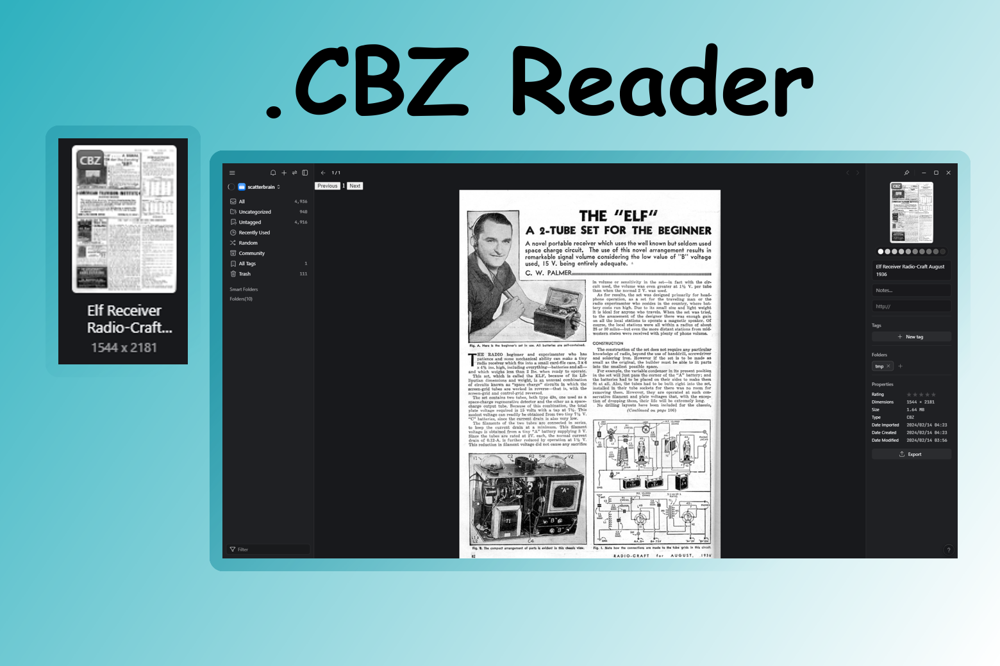

# Comic Book Reader

An Eagle plugin to read comic book files from within the Eagle App.

A cbz file is a comic book archive file that contains images inside it. The files are compressed and stored in a .zip format and named **.cbz**.
Each image in the archive is named with a number e.g.: 01.png, 02.png, 03.png, etc. It Does not matter what the are called as long as the name is used to sort the images in the correct order.

This version supports image pages in: `.png`, `.jpg`, `.jpeg`, `.gif`, `.webp`, `.bmp`, `.heic`, `.heif`.

It also supports basic in-archive video pages in: `.mp4`, `.webm`, `.mov`, `.m4v`, `.ogv`.
Video pages are playable in the reader, and use a generated placeholder in the page thumbnail list.

It supports standard ZIP-based `.cbz` files and also RAR archives that were renamed to `.cbz`.

A Test file is included > [Elf Receiver Radio-Craft August 1936.cbz](<Elf Receiver Radio-Craft August 1936.cbz>)

It only supports .cbz files.

## example

